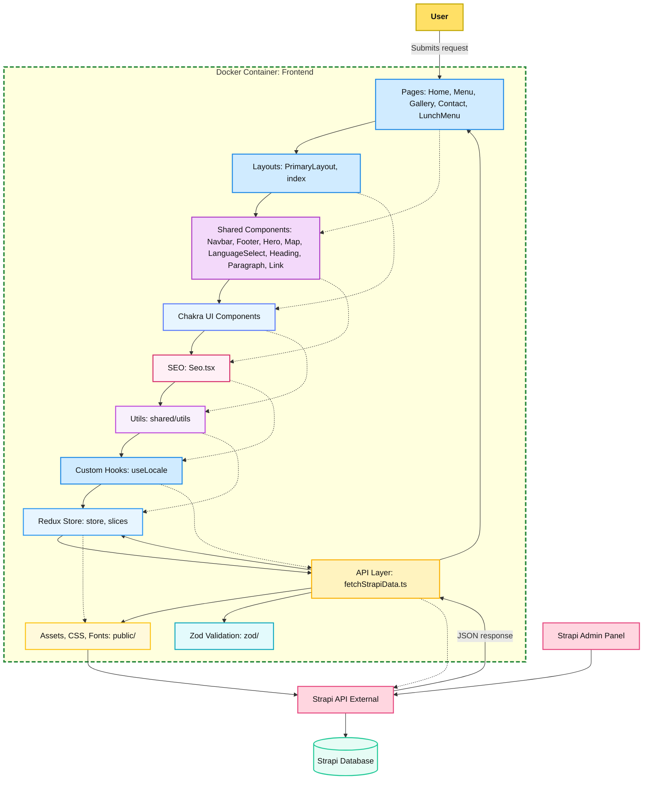

```mermaid
flowchart TD
    %% Vertical layout with "dummy" links for stretching
    User[User]

    subgraph DockerFrontend [Docker Container: Frontend]
        Pages[Pages: Home, Menu, Gallery, Contact, LunchMenu]
        Layouts[Layouts: PrimaryLayout, index]
        Shared[Shared Components: Navbar, Footer, Hero, Map, LanguageSelect, Heading, Paragraph, Link]
        Chakra[Chakra UI Components]
        SEO[SEO: Seo.tsx]
        Utils[Utils: shared/utils]
        Hooks[Custom Hooks: useLocale]
        Store[Redux Store: store, slices]
        API[API Layer: fetchStrapiData.ts]
        Zod[Zod Validation: zod/]
        Public[Assets, CSS, Fonts: public/]
    end

    Backend[Strapi API External]
    StrapiAdmin[Strapi Admin Panel]
    StrapiDB[(Strapi Database)]

    User -->|Submits request| Pages
    Pages --> Layouts
    Layouts --> Shared
    Shared --> Chakra
    Chakra --> SEO
    SEO --> Utils
    Utils --> Hooks
    Hooks --> Store
    Store --> API
    API --> Public
    Public --> Backend
    Backend -->|JSON response| API
    API --> Zod
    API --> Store
    API --> Pages
    Backend --> StrapiDB
    StrapiAdmin --> Backend

    %% Dummy links for more height
    Pages -.-> Shared
    Layouts -.-> Chakra
    Shared -.-> SEO
    Chakra -.-> Utils
    SEO -.-> Hooks
    Utils -.-> Store
    Hooks -.-> API
    Store -.-> Public
    API -.-> Backend

    %% Colors and styles
    classDef user fill:#ffe066,stroke:#bfa600,stroke-width:2px,color:#111,font-weight:bold;
    classDef frontend fill:#d0ebff,stroke:#228be6,stroke-width:2px,color:#111;
    classDef docker fill:#b2f2bb,stroke:#2b8a3e,stroke-width:3px,stroke-dasharray: 8 4,color:#111;
    classDef backend fill:#ffd6e0,stroke:#e64980,stroke-width:2px,color:#111;
    classDef db fill:#e6fcf5,stroke:#20c997,stroke-width:2px,color:#111;
    classDef api fill:#fff3bf,stroke:#fab005,stroke-width:2px,color:#111;
    classDef store fill:#e7f5ff,stroke:#339af0,stroke-width:2px,color:#111;
    classDef shared fill:#f3d9fa,stroke:#ae3ec9,stroke-width:2px,color:#111;
    classDef public fill:#fff9db,stroke:#fcc419,stroke-width:2px,color:#111;
    classDef zod fill:#e3fafc,stroke:#15aabf,stroke-width:2px,color:#111;
    classDef chakra fill:#e7f5ff,stroke:#5c7cfa,stroke-width:2px,color:#111;
    classDef seo fill:#fff0f6,stroke:#d6336c,stroke-width:2px,color:#111;
    classDef utils fill:#f8f0fc,stroke:#be4bdb,stroke-width:2px,color:#111;

    class User user;
    class Pages,Layouts frontend;
    class DockerFrontend docker;
    class Shared shared;
    class Hooks frontend;
    class Store store;
    class API api;
    class Zod zod;
    class Chakra chakra;
    class SEO seo;
    class Utils utils;
    class Public public;
    class Backend,StrapiAdmin backend;
    class StrapiDB db;

    style Pages shape:rect
    style Layouts shape:rect
    style Shared shape:rect
    style Hooks shape:rect
    style Store shape:rect
    style API shape:rect
    style Zod shape:rect
    style Chakra shape:rect
    style SEO shape:rect
    style Utils shape:rect
    style Public shape:rect
    style Backend shape:rect
    style StrapiAdmin shape:rect
    style StrapiDB shape:rect
    style DockerFrontend stroke:#2b8a3e,stroke-width:3px,stroke-dasharray: 8 4;
```
