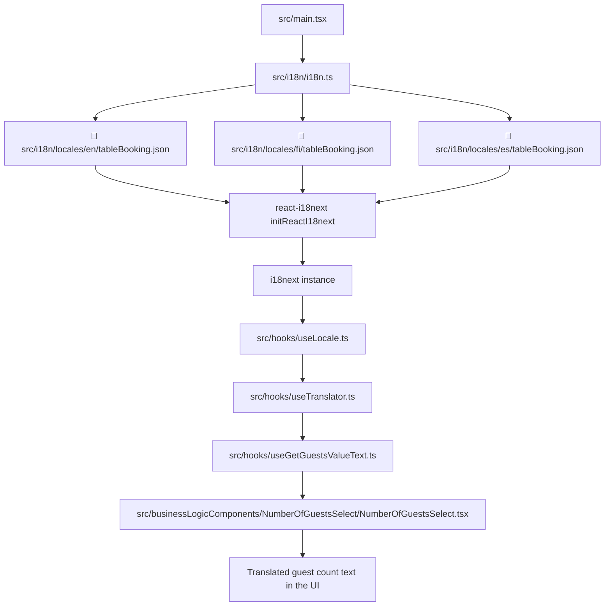

# Internationalization Flow

## Install

If the translation packages are not already installed, add them with:

```bash
npm install i18next react-i18next
```

## Why Both Packages Are Used Together

- `i18next` is the translation engine. It stores translation resources, resolves keys, handles interpolation, plural rules, and language fallback.
- `react-i18next` is the React adapter. It connects `i18next` to React through `initReactI18next`, so components can react to language changes and use i18n in a React-friendly way.

## Ordered Explanation

1. `src/main.tsx` imports `src/i18n/i18n.ts` before rendering the app, so the translation engine is initialized once at startup.
2. `src/i18n/i18n.ts` configures `i18next`, registers `react-i18next`, sets the default and fallback language, and imports all translation JSON files from `src/i18n/locales/`.
3. `src/i18n/locales/en/tableBooking.json`, `src/i18n/locales/fi/tableBooking.json`, and `src/i18n/locales/es/tableBooking.json` contain the actual message strings for each supported language. These files are loaded into i18next as resource bundles.
4. `src/zod/locale.ts` defines the supported locale values and maps URL-friendly locale values to app locale values.
5. `src/hooks/useLocale.ts` reads the locale from the route params and returns the active app locale.
6. `src/hooks/useTranslator.ts` wraps `i18next.t(...)` and always sends the current app locale to the translator.
7. `src/hooks/useGetGuestsValueText.ts` uses the translator to choose the correct singular or plural guest label.
8. `src/businessLogicComponents/NumberOfGuestsSelect/NumberOfGuestsSelect.tsx` renders the translated guest text in the guest counter input.

## What This Logic Does

- The app detects the current locale from the URL.
- The locale is converted to the language code that `i18next` understands.
- The translator looks up the correct key in the correct language bundle.
- The guest counter displays the translated singular or plural string.

## Folder Structure

The translation resources are organized by language in `src/i18n/locales/`:

```
src/i18n/
├── i18n.ts                 # Main i18next configuration file
└── locales/
    ├── en/
    │   └── tableBooking.json    # English translations for table booking feature
    ├── fi/
    │   └── tableBooking.json    # Finnish translations for table booking feature
    └── es/
        └── tableBooking.json    # Spanish translations for table booking feature
```

### File Details

- **`src/i18n/i18n.ts`**: Initializes i18next, registers the adapter, sets default language (fi), fallback language, supported languages list, and imports all translation JSON files.

- **`src/i18n/locales/en/tableBooking.json`**: Contains English message strings for the table booking form, such as singular and plural forms for guest count.
  Example:

  ```json
  {
    "number_of_guests_input_value": "{{guests}} guest",
    "number_of_guests_input_value_plural": "{{guests}} guests"
  }
  ```

- **`src/i18n/locales/fi/tableBooking.json`**: Contains Finnish message strings for the table booking form.
  Example:

  ```json
  {
    "number_of_guests_input_value": "{{guests}} vieras",
    "number_of_guests_input_value_plural": "{{guests}} vierasta"
  }
  ```

- **`src/i18n/locales/es/tableBooking.json`**: Contains Spanish message strings for the table booking form.
  Example:
  ```json
  {
    "number_of_guests_input_value": "{{guests}} invitado",
    "number_of_guests_input_value_plural": "{{guests}} invitados"
  }
  ```

### How to Add a New Namespace

If you add a new feature that needs translations:

1. Create a new JSON file in each language folder: `src/i18n/locales/{lang}/newFeature.json`
2. Add your translation keys and values to each file.
3. Import the new files in `src/i18n/i18n.ts` and add them to the resources object.
4. Use `useTranslator()` in your component to access the translations with `t("newFeature", "key_name", params)`.

## Flow Diagram


